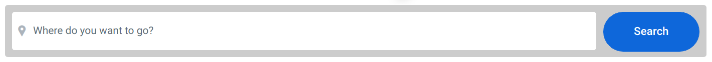
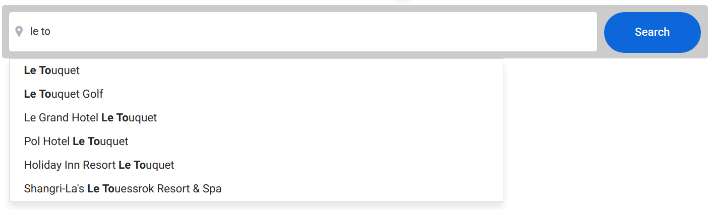

# Autocomplete

Your task is to create an autocomplete utilising part of the [Your Golf Travel API](https://www.yourgolftravel.com/api/autocomplete).

## Instructions

* Clone the repo. Webpack is already included so you can run a dev server using `npm start`, and navigate to it by visiting http://localhost:8080. Sass is also included, should you wish to use it. You can install any extra packages/frameworks you want by adding them to the `package.json`.

* Create an autocomplete that shows a list of venues that have a name matching the user's input. The list of results should update dynamically as the input changes.

* Our public API provides an autocomplete endpoint, which is proxied through http://localhost:8080/api/autocomplete. You can provide a query term using a query parameter named `q` e.g. `/api/autocomplete?q=golf`.

* The destination URL is calculated by appending `https://www.yourgolftravel.com/` to the `slug` parameter in the results. The user can click any of the results to navigate to that result, or click the 'Search' button to navigate automatically to the first result.

* In terms of design, try to follow the mockups as closely as possible. Bonus points for making it responsive!

## Mockups

The following mockup shows the autocomplete in action:

#### Closed:

#### Open:

